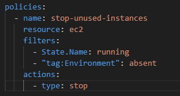
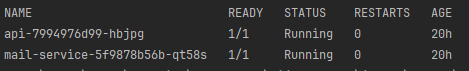
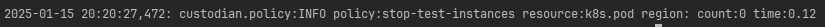
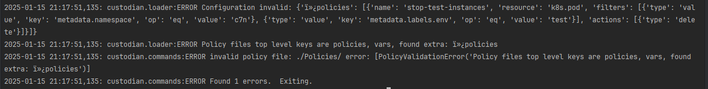
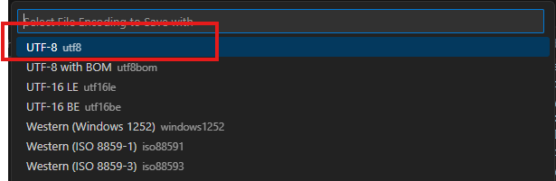
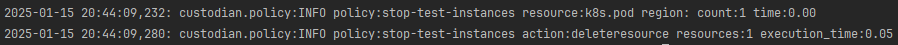
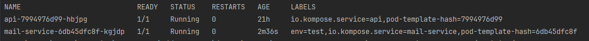

# Bewaak de kwaliteit van je cluster


*[Hugo Kemme, januari 2025.](https://github.com/hanaim-devops/blog-student-naam)*
<hr/>

In deze blogpost ga ik het hebben over mijn onderzoek naar Cloud custodian. Ik heb deze open source tool gekozen, omdat ik automatisering heel gaaf vindt. Hoe mooi is het als je een speciefieke set regels kan definieren en het programma de rest doet.

Ik moet deze tool tijdens het project ook gaan implementeren samen met de onderzochte tools van mijn groepsgenoten. Cloud custodian werkt goed samen met publieke cloudproviders, zoals; AWS, Azure & GCP. Maar ook met Kubernetes en docker. Door deze brede samenwerkingmogelijkheden lijkt dit mij een geschikte tool.
<hr/>

Ik heb voor dit onderzoek de volgende hoofdvraag opgestelt:
`Hoe kan ik Cloud custodian inzetten in het project bij het automatizeren van governence?`

Om deze hoofdvraag te beantwoorden heb ik de volgende deelvragen opgestelt: 
1. Wat is Cloud custodian en hoe werkt het?
2. Waarom is cloud governance belangrijk en welke rol speelt Cloud Custodian hierin?
3. Wat zijn voor- en nadelen van Cloud custodian?
4. Welke altenatieven zijn er?
5. Hoe kan ik Cloud custodian implementeren op een simpele applicatie?
6. Hoe kan ik Cloud custodian gebruiken tijdens mijn project?

Om deze deelvragen te kunnen beantwoorden heb ik gekozen voor verschillende onderzoeksmethode van de ICT onderzoeksmethoden (Hbo-I, n.d.). Deze zal ik toelichten tijdens het behandelen van de deelvragen.

# Wat is Cloud custodian?
Cloud Custodian is een open-source tool die helpt bij het beheren en automatiseren van governance in cloudomgevingen. Governance gaat over het vaststellen van regels en richtlijnen voor het gebruik en beheer van IT- en cloudresources, zoals beveiliging, compliance en kostenbeheer. Cloud Custodian biedt een eenvoudige manier om deze regels te definiëren en af te dwingen in publieke clouds, zoals AWS, Azure, en Google Cloud Platform (GCP), maar het kan ook worden geïntegreerd met Kubernetes en Docker.

Cloud Custodian maakt gebruik van het principe "policy as code". Dit betekent dat je regels (policies) schrijft in YAML-bestanden, waarbij je aangeeft welke cloudresources moeten worden gecontroleerd en welke acties moeten worden uitgevoerd. Zo kan je een regel maken die automatisch niet gebruikte contrainers opspoort en afsluit.

Cloud Custodian werkt met een event-driven-architecture (EDA), dit betekent dat het kan worden getriggerd door gebeurtenissen in de cloud, en direct actie kan ondernemen op basis van de ingestelde regels. op deze manier kunnen bepaalde veiligheidsnormen worden gehandhaafd en kosten worden geoptimaliseerd.

## Hoe werkt Cloud Custodian?
Cloud Custodian werkt op basis van policies. Deze polices bestaan uit simpele filters en acties die in YAML-bestanden worden gedefinieerd. Een policy wordt altijd op dezelfde manier opgebouwd;

- <b>Resource:</b> Bepaalde cloudresources worden geselecteerd, zoals EC2-instances, S3-buckets, of databases.
- <b>Filters:</b> Hier geef je de voorwaarden aan die bepalen welke resources actie vereisen, bijvoorbeeld instances die langer dan 7 dagen inactief zijn.
- <b>Acties:</b> Dit zijn de automatische reacties op de gefilterde resources, zoals het stoppen, verwijderen, of taggen van resources.

### Voorbeeld



<i>Afbeelding 1. Voorbeeld policy</i>

Deze policy stopt alle EC2-instances die draaien en geen "Environment" tag hebben.

# Cloud governance
Cloud governance is belangrijk omdat het helpt bij het beheren van de veiligheid, compliance, en kosten in cloudomgevingen. Het zorgt ervoor dat cloudresources efficiënt worden gebruikt, voldoen aan regelgeving, en beschermd zijn tegen beveiligingsrisico's.

Cloud Custodian speelt hierin een rol door governance te automatiseren. Het stelt organisaties in staat om "policy as code" te definiëren, zoals het afdwingen van versleuteling of het stoppen van ongebruikte container instanties. Hierdoor worden processen gestroomlijnd, compliance gewaarborgd en kosten geoptimaliseerd.


# Voordelen
- Cloud Custodian maakt het mogelijk om governanceprocessen te automatiseren, waardoor je cloudomgevingen kunt beheren zonder handmatig een actie uit te voeren. Dit bespaart tijd en minimaliseert fouten.
- Het werkt met meerdere cloudproviders, zoals AWS, Azure, en Google Cloud Platform, maar ook met Kubernetes en Docker.
- Policy as code wordt geschreven in eenvoudige YAML-bestanden, waardoor ze makkelijk te begrijpen en te beheren zijn.
- Door ongebruikte of inefficiënte resources te identificeren en automatisch te beheren (bijvoorbeeld afsluiten van inactieve instances), helpt Cloud Custodian bij het besparen van kosten.

# Nadelen
- Hoewel de YAML-syntaxis eenvoudig is, vereist het wel enige technische kennis om policies effectief op te stellen en aan te passen. Gebruikers moeten ook een goed begrip hebben van de cloudomgeving waarin ze werken.
- Gebruikers moeten het merendeel van hun werk via de command-line of API uitvoeren.
- Onderhoud en updates kunnen achterlopen tot stilvallen, omdat het een open source tool is.

</br>
Samengevat biedt Cloud Custodian veel voordelen voor automatisering, multi-cloudbeheer, en kostenoptimalisatie, maar vereist het enige technische kennis en onderhoud.

</br>

# Alternatieven
<table> 
    <tr>
        <th>Applicatie</th>
        <th>Beschrijving</th>
        <th>Voordelen</th>
        <th>Nadelen</th>
    </tr>
    <tr>
        <td>AWS Config</td>
        <td>AWS Config is een dienst van Amazon die continue monitoring en beoordeling van de configuratie van AWS-resources mogelijk maakt. Het helpt bij het controleren of cloudresources voldoen aan compliance-standaarden en geeft inzicht in configuratiewijzigingen.</td>
        <td>Diepe integratie met AWS, uitgebreide rapportages en compliance-controle.</td>
        <td>Beperkt tot AWS, geen multi-cloudondersteuning.</td>
    </tr>
    <tr>
        <td>Terraform</td>
        <td>Terraform is een populaire Infrastructure as Code (IaC) tool waarmee je cloudresources kunt beheren. Sentinel is een beleid-als-code framework van HashiCorp dat je kunt gebruiken met Terraform om governance regels en compliance te handhaven.</td>
        <td>Multi-cloud ondersteuning, krachtige beleidscontrole met Sentinel, sterke community en ondersteuning voor IaC.</td>
        <td>Complexiteit bij het configureren van regels en policies, vereist extra kennis van Terraform en Sentinel.</td>
    </tr>
    <tr>
        <td>Open Policy Agent</td>
        <td>Een open-source policy engine die je kunt gebruiken om uniforme beleidsregels af te dwingen over verschillende systemen, zoals Kubernetes, CI/CD-tools, microservices en cloudinfrastructuur. Het biedt een flexibele manier om policies te definiëren en te handhaven. Zie blog van [Junjie](.)</td>
        <td>Multi-platform, krachtige beleidsengine, brede inzetbaarheid (ook buiten cloud resources).</td>
        <td>Vergeleken met Cloud Custodian meer complex om op te zetten en configureren, vereist kennis van de Rego policy-taal.</td>
    </tr>
</table>
<i>Tabel 1. Alternatieven volgens ChatGPT. (ChatGPT - Alternatieven Voor Cloud Custodian, n.d.)</i>

</br>

# Implementatie in een simpele applicatie
Voor deze implementatie ga ik een simpele microservice applicatie opzetten in minikube. Het maakt hierin niet uit wat de pods doen, zolang ze maar draaien. Ik ga hiervoor gebruik maken van dit [project](../../C7N/). Ik heb nu 2 pods draaien in de namespace "c7n". Dit kun je zien met het commando:

```ps1
kubectl get pods -n c7n
```
<i>Code snippet 1. Controleer draaiende pods.</i>

</br>


</br>
<i>Afbeelding 1. De op dit moment draaiende pods.</i>

</br>

Nu het project is opgezet kan c7n geinstalleerd worden. Dit wordt gedaan via Python, dus als dit nog niet geinstalleerd is, moet deze ook geinstalleerd worden. Voor de installatie van Python verwijs ik naar de website van [Python](https://www.python.org/downloads/). Het commando om Cloud Custodian te installeren op windows ziet er als volgt uit:
```ps1

python3 -m venv custodian
.\custodian\Scripts\Activate.ps1
pip install c7n
```
<i>Code snippet 2.  Installeer commando Cloud Custodian voor windows</i>

Mocht het geinstalleerd moeten worden voor een ander besturingssysteem, is het handig om even naar de docs te kijken op de [Cloud Custodian](https://cloudcustodian.io/docs/quickstart/index.html#install-cc) website. Ter controle van de installatie kan dit commando uitgevoerd worden:

```ps1
custodian version
```
<i>Code snippet 3. Controleer installatie</i>

Dit zou een versienummer moeten tonen als de installatie is geslaagd. Nu alles is opgezet kan een eerste policy worden gemaakt. Omdat er meerdere policies gedefinieerd kunnen worden, zet ik deze in een aparte folder genaamd "Policies". Ik ga een policy maken die controlleert of een pod het label "test" bevat, als dit het geval is wordt de pod gestopt. Deze policy ziet er zo uit:

```yaml
policies:
  - name: stop-test-instances
    resource: k8s.pod
    filters:
      - type: value
        key: metadata.namespace
        op: eq
        value: c7n
      - type: value
        key: metadata.labels.env
        op: eq
        value: "test"
    actions:
      - type: delete
```
<i>Code snippet 4. Voorbeeld policy.yaml</i>

In deze policy is gespecifieerd wat de naam van de policy is en om wat voor een resource het gaat, in dit geval een kubernetes pod. Wat Cloud Custodian krachtig maakt, zijn de filters. Zo kan er op bijna alle beschikbare informatie over een pod gefilterd worden, denk hierbij aan: regio, status, cpu gebruik, etc (Generic Filters — Cloud Custodian  Documentation, n.d.). In dit geval filter ik op namespace c7n. Hierin staat "eq" voor equal. Vervolgens wordt er gefilterd op label env=test. Aangezien er nog geen pods gelabeled zijn, wordt er hier geen resultaat verwacht. De policy kan uitgevoerd worden met het commando:

```ps1
custodian run --dryrun -s . ./Policies/
```
<i>Code snippet 5. Uitvoeren van policy.</i>

Ik run het commando met de flag "--dryrun", zodat de actie nog niet wordt uitgevoerd en ik kan zien wat het resultaat is van de policy. Het resultaat van de policy is nu:


</br>
<i>Afbeelding 2. Resultaat van de policy met "dryrun" flag. </i>

</br>

Nu kan het gebeuren dat je een foutmelding krijgt met allemaal vreemde tekens, zoals deze:

<i>Afbeelding 3. Voorbeeld van foutmelding na uitvoeren van policy.</i>
</br>

Dit heeft te maken met hoe het bestand is opgeslagen. Dit moet "UTF-8" zijn, zonder "BOM". Dit kan veranderd worden in een texteditor. Ik ga het laten zien in VS code. Eerst moet het commando menu geopend worden, dit kan met "CTRL + SHIFT + P". Hier kan je zoeken naar "Change file encoding", daarna krijg je dit menu:


</br>
<i>Afbeelding 4. Verander de file encoding naar "UTF-8". </i>

</br>

Nu ga ik een [pod labelen](https://kubernetes.io/docs/reference/kubectl/generated/kubectl_label/) met env=test. Als ik nu de policy opnieuw ga uitvoeren zal de count op 1 staan. Ik ga de policy nu uitvoeren zonder de flag "--dryrun". De pod zal nu gestopt worden.

```ps1
custodian run -s . ./Policies/
```
<i>Code snippet 6. Uitvoeren van policy. </i>
</br>

Het resultaat hiervan is dit:

</br>
<i>Afbeelding 3. Resultaat policy zonder dryrun flag. </i>

Als ik nu kijk naar de draaiende pods, is te zien dat de pod met het label "env=test" opnieuw is opgestart. De pod is niet verwijder door de replicaset die ervoor zorgt dat er altijd een draait.


<i>Afbeelding 5. Opnieuw opgestartte pod. </i>

</br>

# Conclusie
Met behulp van Cloud Custodian kan ervoor gezord worden dat cloud resources zich aan bepaalde regels moeten houden. Zo kan het voorkomen worden dat er pods blijven rond zweven, zonder dat je daar vanaf weet. Cloud Custodian kan ook ingezet worden om webhooks te gebruiken en messages te sturen via slack. Ik wil dit tijdens het project inzetten op alle pods die niet de status "running" hebben. Zo kan ik direct zien wanneer een pod het niet doet.


# Bronnen
 * Cloud Custodian Documentation — Cloud Custodian  documentation. (n.d.). https://cloudcustodian.io/docs/index.html
 * Stacklet. (2024, September 23). Cloud Custodian. https://stacklet.io/cloud-custodian/
 * Mendez, W. (2022, July 25). Cloud Custodian — things I wish I knew at the beginning. Medium. https://medium.com/globant/cloud-custodian-things-i-wish-i-knew-at-the-beginning-2743cf948066
 * Stacklet. (2024a, February 16). Beyond the basics: discovering powerful, Lesser-Known uses of cloud custodian - [Video]. YouTube. https://www.youtube.com/watch?v=hUKJKkRzNmY
 * OtherDevOpsGene. (2022b, March 2). What is Cloud Custodian? [Video]. YouTube. https://www.youtube.com/watch?v=bGtQiGQOkHs
 * Hbo-I. (n.d.). ICT Research Methods — Methods Pack for research in ICT. ICT Research Methods. https://ictresearchmethods.nl/
 * ChatGPT - Alternatieven voor Cloud Custodian. (n.d.). ChatGPT. https://chatgpt.com/share/67894a72-1374-8001-ad4b-dc39bc44b040
 * Download Python. (n.d.). Python.org. https://www.python.org/downloads/