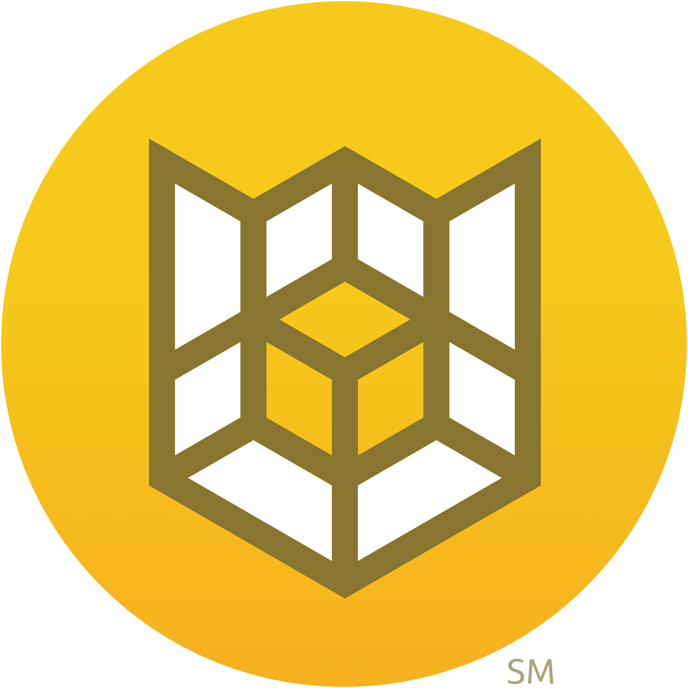

# Cloud custodian

*[Hugo Kemme, oktober 2024.](https://github.com/hanaim-devops/blog-student-naam)*

In deze blogpost ga ik het hebben over mijn onderzoek naar Cloud custodian. Ik heb deze open source tool gekozen, omdat ik automatisering heel gaaf vindt. Hoe mooi is het als je een speciefieke set regels kan definieren en het programma de rest doet.

Ik moet deze tool tijdens het project ook gaan implementeren samen met de onderzochte tools van mijn groepsgenoten. Cloud custodian werkt goed samen met publieke cloudproviders, zoals; AWS, Azure & GCP. Maar ook met Kubernetes en docker. Door deze brede samenwerkingmogelijkheden leek dit mij een geschikte tool.

Ik heb voor dit onderzoek de volgende hoofdvraag opgestelt:
`Hoe kan ik Cloud custodian inzetten in het project bij het automatizeren van governence?`

Om deze hoofdvraag te beantwoorden heb ik de volgende deelvragen opgestelt: 
1. Wat is Cloud custodian en hoe werkt het?
2. Waarom is cloud governance belangrijk en welke rol speelt Cloud Custodian hierin?
3. Wat zijn voor- en nadelen van Cloud custodian?
4. Welke altenatieven zijn er?
5. Hoe kan ik Cloud custodian implementeren op een simpele applicatie?
6. Hoe kan ik Cloud custodian gebruiken tijdens mijn project?

Om deze deelvragen te kunnen beantwoorden heb ik gekozen voor verschillende onderzoeksmethode van de [ict researchmethods](.). Deze zal ik toelichten tijdens het behandelen van de deelvragen.

# Wat is Cloud custodian?
Cloud Custodian is een open-source tool die helpt bij het beheren en automatiseren van governance in cloudomgevingen. Governance gaat over het vaststellen van regels en richtlijnen voor het gebruik en beheer van IT- en cloudresources, zoals beveiliging, compliance en kostenbeheer. Cloud Custodian biedt een eenvoudige manier om deze regels te definiëren en af te dwingen in publieke clouds, zoals AWS, Azure, en Google Cloud Platform (GCP), maar het kan ook worden geïntegreerd met Kubernetes en Docker.

Cloud Custodian maakt gebruik van het principe "policy as code". Dit betekent dat je regels (policies) schrijft in YAML-bestanden, waarbij je aangeeft welke cloudresources moeten worden gecontroleerd en welke acties moeten worden uitgevoerd. Zo kan je een regel maken die automatisch niet gebruikte contrainers opspoort en afsluit.

Cloud Custodian werkt met een event-driven-architecture (EDA), dit betekent dat het kan worden getriggerd door gebeurtenissen in de cloud, en direct actie kan ondernemen op basis van de ingestelde regels. op deze manier kunnen bepaalde veiligheidsnormen worden gehandhaafd en kosten worden geoptimaliseerd.

## Hoe werkt Cloud Custodian?
Cloud Custodian werkt op basis van policies. Deze polices bestaan uit simpele filters en acties die in YAML-bestanden worden gedefinieerd. Een policy wordt altijd op dezelfde manier opgebouwd;

- <b>Resource:</b> Bepaalde cloudresources worden geselecteerd, zoals EC2-instances, S3-buckets, of databases.
- <b>Filters:</b> Hier geef je de voorwaarden aan die bepalen welke resources actie vereisen, bijvoorbeeld instances die langer dan 7 dagen inactief zijn.
- <b>Acties:</b> Dit zijn de automatische reacties op de gefilterde resources, zoals het stoppen, verwijderen, of taggen van resources.

### Voorbeeld

<i>[Afbeelding 1.](plaatjes/voorbeeld-policy.png) Voorbeeld policy</i>

Deze policy stopt alle EC2-instances die draaien, maar geen "Environment" tag hebben.

Cloud Custodian maakt het eenvoudig om governance te automatiseren en zorgt ervoor dat je cloudomgeving efficiënt, veilig en kosteneffectief blijft, zonder handmatig beheer.

# Cloud governance
Cloud governance is belangrijk omdat het helpt bij het beheren van de veiligheid, compliance, en kosten in cloudomgevingen. Het zorgt ervoor dat cloudresources efficiënt worden gebruikt, voldoen aan regelgeving, en beschermd zijn tegen beveiligingsrisico's.

Cloud Custodian speelt hierin een rol door governance te automatiseren. Het stelt organisaties in staat om "policy as code" te definiëren, zoals het afdwingen van versleuteling of het stoppen van ongebruikte container instanties. Hierdoor worden processen gestroomlijnd, compliance gewaarborgd en kosten geoptimaliseerd.

# Voordelen
- Cloud Custodian maakt het mogelijk om governanceprocessen te automatiseren, waardoor je cloudomgevingen kunt beheren zonder handmatig een actie uit te voeren. Dit bespaart tijd en minimaliseert fouten.
- Het werkt met meerdere cloudproviders, zoals AWS, Azure, en Google Cloud Platform, maar ook met Kubernetes en Docker.
- Policy as code wordt geschreven in eenvoudige YAML-bestanden, waardoor ze makkelijk te begrijpen en te beheren zijn.
- Door ongebruikte of inefficiënte resources te identificeren en automatisch te beheren (bijvoorbeeld afsluiten van inactieve instances), helpt Cloud Custodian bij het besparen van kosten.

# Nadelen
- Hoewel de YAML-syntaxis eenvoudig is, vereist het wel enige technische kennis om policies effectief op te stellen en aan te passen. Gebruikers moeten ook een goed begrip hebben van de cloudomgeving waarin ze werken.
- Gebruikers moeten het merendeel van hun werk via de command-line of API uitvoeren.
- Onderhoud en updates kunnen achterlopen tot stilvallen, omdat het een open source tool is.

\
Samengevat biedt Cloud Custodian veel voordelen voor automatisering, multi-cloudbeheer, en kostenoptimalisatie, maar vereist het enige technische kennis en onderhoud.

# Alternatieven
<table> 
    <tr>
        <th>Applicatie</th>
        <th>Beschrijving</th>
        <th>Voordelen</th>
        <th>Nadelen</th>
    </tr>
    <tr>
        <td>AWS Config</td>
        <td>AWS Config is een dienst van Amazon die continue monitoring en beoordeling van de configuratie van AWS-resources mogelijk maakt. Het helpt bij het controleren of cloudresources voldoen aan compliance-standaarden en geeft inzicht in configuratiewijzigingen.</td>
        <td>Diepe integratie met AWS, uitgebreide rapportages en compliance-controle.</td>
        <td>Beperkt tot AWS, geen multi-cloudondersteuning.</td>
    </tr>
    <tr>
        <td>Terraform</td>
        <td>Terraform is een populaire Infrastructure as Code (IaC) tool waarmee je cloudresources kunt beheren. Sentinel is een beleid-als-code framework van HashiCorp dat je kunt gebruiken met Terraform om governance regels en compliance te handhaven.</td>
        <td>Multi-cloud ondersteuning, krachtige beleidscontrole met Sentinel, sterke community en ondersteuning voor IaC.</td>
        <td>Complexiteit bij het configureren van regels en policies, vereist extra kennis van Terraform en Sentinel.</td>
    </tr>
    <tr>
        <td>Open Policy Agent</td>
        <td>Een open-source policy engine die je kunt gebruiken om uniforme beleidsregels af te dwingen over verschillende systemen, zoals Kubernetes, CI/CD-tools, microservices en cloudinfrastructuur. Het biedt een flexibele manier om policies te definiëren en te handhaven. Zie blog van [Junjie](.)</td>
        <td>Multi-platform, krachtige beleidsengine, brede inzetbaarheid (ook buiten cloud resources).</td>
        <td>Vergeleken met Cloud Custodian meer complex om op te zetten en configureren, vereist kennis van de Rego policy-taal.</td>
    </tr>
</table>
<i>Tabel 1. Alternatieven volgens [ChatGPT](.) </i>

\
# Implementatie in een simpele applicatie
